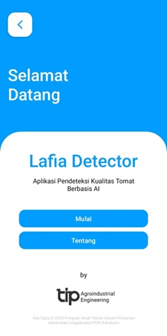

# Lafia Project

    
    

## Lafia Detector

This is an Android application that detects the freshness of tomatoes using a deep learning model. The model is based on transfer learning with YOLOv8 and has been trained on a custom dataset from Roboflow.

## Features

- Detects the freshness of tomatoes in real-time using the camera.
- Provides a freshness score to help users make informed decisions.
- Easy-to-use interface with clear instructions.

## Model Training

The model was trained using transfer learning with YOLOv8 on a custom dataset from Roboflow. Once trained, the custom YOLOv8 model was converted to TensorFlow Lite for deployment on Android.

## Download

The application can be downloaded from the following link:

[Download Lafia Detector APK](https://drive.google.com/file/d/1XTaKibZQVaXQsfYLlI8x4MWIeA6F8Spf/view?usp=sharing)

## License

This project is licensed under the MIT License - see the [LICENSE](LICENSE) file for details.

## Acknowledgements

- [YOLOv8](https://github.com/ultralytics/yolov8) for the object detection framework.
- [Roboflow](https://roboflow.com/) for the custom dataset and tools.
- The contributors who made this project possible.

## Contact

Creator
1. Tresna Ayu Safitri
2. Firmansyah
3. Muhammad Ijlal Senja Pratama

Program Studi Teknik Industri Pertanian Universitas Linggabuana PGRI Sukabumi

If you have any questions or suggestions, feel free to open an issue or contact us at [tip@unlip.ac.id](mailto:your-email@tip@unlip.ac.id).

